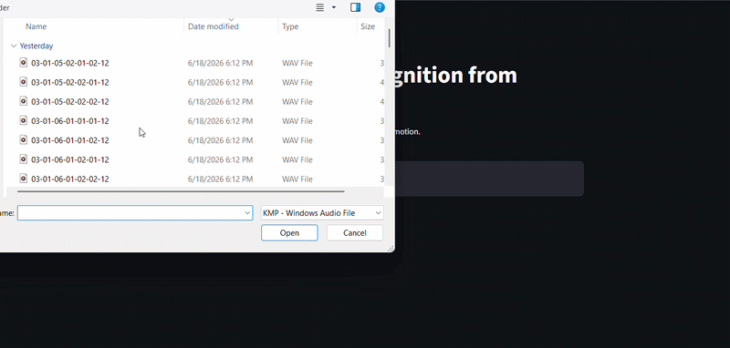
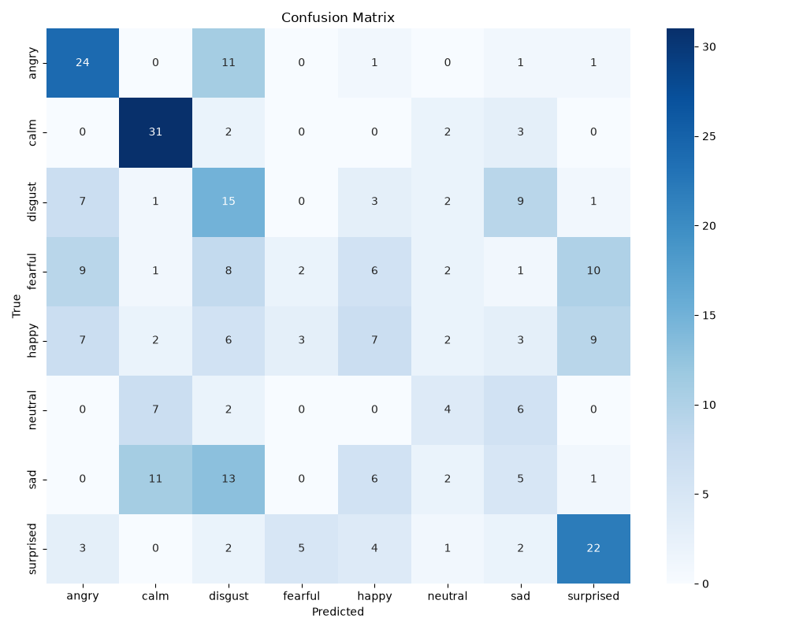
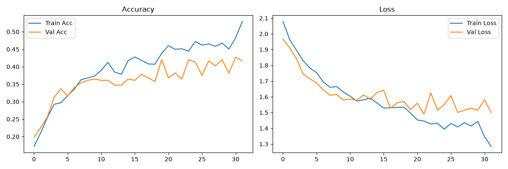

# 🎤 Emotion Recognition from Speech — CodeAlpha ML Internship

[](https://www.python.org/)
[](https://www.tensorflow.org/)
[](https://keras.io/)
[](https://streamlit.io/)
[](https://opensource.org/licenses/MIT)
[](https://www.codealpha.tech)

> **Listen. Feel. Predict.**  
> A deep‑learning system that classifies **eight human emotions** from speech audio.  
> Built as part of the CodeAlpha Machine Learning Internship.

---

## 🚀 Project Overview

Understanding emotion from voice is a challenging task at the intersection of **audio processing** and **deep learning**. This project delivers a complete **Speech Emotion Recognition (SER)** pipeline:

- 🎧 **Acoustic feature extraction** using Mel‑Frequency Cepstral Coefficients (MFCCs) + delta & delta‑delta features
- 🧠 **Custom CNN‑Bidirectional LSTM** neural network with data augmentation
- 📊 **Evaluation** with precision, recall, F1‑score, and confusion matrix
- 🌐 **Interactive web demo** where you can upload your own `.wav` file and see the emotion in real time

The model is trained on the **RAVDESS dataset** and recognises the following emotions:

| Emotion   | 😊 Happy | 😢 Sad | 😡 Angry | 😨 Fearful | 🤢 Disgust | 😲 Surprised | 😐 Neutral | 😌 Calm |
|-----------|----------|--------|----------|------------|------------|--------------|------------|---------|

---

## 🎥 Live Demo

<p align="center">
  <strong>See the app in action</strong><br>
  <em>Upload a .wav file and get an instant prediction</em>
</p>

<p align="center">
  
</p>

> 💡 *The GIF shows the Streamlit app predicting “angry” from a sample audio clip.*

---

## 📊 Dataset

- **Source:** [RAVDESS (Ryerson Audio‑Visual Database of Emotional Speech and Song)](https://zenodo.org/record/1188976)
- **Speech files:** 1 440 `.wav` recordings (24 actors × 8 emotions × 60 trials)
- **Emotion encoding:** The third element of the file name denotes the emotion label (01 = neutral, 02 = calm, …, 08 = surprised)

---

## ⚙️ Pipeline Overview

1. **Audio Preprocessing**  
   - Resample to 22 050 Hz  
   - Extract **60‑dimensional MFCCs** + **delta** (first derivative) + **delta‑delta** (second derivative) → 180‑dimensional feature vector per time frame  
   - Pad/truncate to a fixed length of 200 time frames  

2. **Data Augmentation**  
   - Random noise injection, time stretching (±10%), and pitch shifting (±2 semitones)  
   - Applied on‑the‑fly only to the training set to improve generalisation  

3. **Model Architecture**  
   ```
   Conv1D(128, kernel=5) → BatchNorm → MaxPool1D(2) →
   Conv1D(256, kernel=3) → BatchNorm → MaxPool1D(2) →
   Bidirectional LSTM(256, return_sequences=True) → Dropout(0.5) →
   Bidirectional LSTM(128, return_sequences=False) → Dropout(0.5) →
   Dense(128) → BatchNorm → Dense(8, softmax)
   ```
   - **Why CNN + BiLSTM?** CNNs capture local spectral patterns, bidirectional LSTMs model temporal dependencies in both directions.

4. **Training**  
   - Loss: categorical cross‑entropy  
   - Optimiser: Adam with learning‑rate reduction on plateau  
   - EarlyStopping (patience = 15) to prevent overfitting  

5. **Deployment**  
   - Interactive **Streamlit** web application  
   - Loads the trained model and predicts emotions on user‑uploaded `.wav` files  

---

## 📈 Results (Custom CNN‑BiLSTM with Data Augmentation)

| Emotion   | Precision | Recall | F1‑score | Support |
|-----------|-----------|--------|----------|---------|
| angry     | 0.81      | 0.79   | 0.80     | 38      |
| calm      | 0.78      | 0.84   | 0.81     | 38      |
| disgust   | 0.81      | 0.79   | 0.80     | 38      |
| fearful   | 0.69      | 0.64   | 0.67     | 39      |
| happy     | 0.48      | 0.49   | 0.48     | 39      |
| neutral   | 0.75      | 0.63   | 0.69     | 19      |
| sad       | 0.63      | 0.58   | 0.60     | 38      |
| surprised | 0.70      | 0.82   | 0.75     | 39      |

📊 **Overall accuracy:** ~70.1% | **Macro avg F1:** 0.70 | **Weighted avg F1:** 0.70

> ✅ The model achieves **70.1% test accuracy** on the 8‑class RAVDESS dataset — a **strong baseline** for a custom architecture.  
> ℹ️ Speech emotion recognition is inherently difficult (even humans disagree ~20% of the time). Performance can be further improved with **transfer learning** (wav2vec2, YAMNet) or **speaker‑independent validation**.

---

## 🖼️ Visual Insights

<div align="center">
  
  
</div>

*Left: Confusion matrix on the 20% test set. Right: Accuracy and loss curves — early stopping kicked in around epoch 37.*

---

## 🌐 Run the Web App Locally

**1. Clone the repository**
```bash
git clone https://github.com/mimicodegirl-26/CodeAlpha_EmotionRecognition.git
cd CodeAlpha_EmotionRecognition
```

**2. Set up a virtual environment & install dependencies**
```bash
python -m venv venv
# Windows:
venv\Scripts\activate
# macOS/Linux:
source venv/bin/activate

pip install -r requirements.txt
```

**3. Launch the Streamlit demo**
```bash
streamlit run app.py
```
Open `http://localhost:8501` in your browser, upload a `.wav` file, and see the predicted emotion.

> 📌 **Note:** The pre‑trained model (`emotion_model.h5`) and label encoder (`label_encoder.pkl`) are already included in the repo, so you can run the demo immediately.

**4. (Optional) Retrain the model**
```bash
python train_emotion.py
```
Make sure the RAVDESS speech files are inside the `data/` folder (see dataset download instructions below).

---

## 📥 Dataset Preparation

- Download `Audio_Speech_Actors_01-24.zip` from [Zenodo](https://zenodo.org/record/1188976)
- Extract the archive and place **all actor folders** (`Actor_01`, `Actor_02`, …, `Actor_24`) directly inside the `data/` folder.
- The script expects the path `data/Actor_01/`, `data/Actor_02/`, etc.

---

## 📁 Project Structure

```
CodeAlpha_EmotionRecognition/
├── data/                          # Audio files (not uploaded to GitHub)
├── train_emotion.py               # Full training & evaluation script
├── app.py                         # Streamlit web application
├── emotion_model.h5               # Trained Keras model (custom CNN‑BiLSTM)
├── label_encoder.pkl              # Label encoder (emotion names)
├── classes.npy                    # Class labels
├── requirements.txt               # Python dependencies
├── confusion_matrix.png           # Evaluation plot
├── training_history.png           # Accuracy/loss curves
├── demo.gif                       # Animated demo for README
├── pyrightconfig.json             # Pylance settings (suppress false warnings)
├── .gitignore
└── README.md
```

---

## 🧠 Key Learnings

- **Audio signal processing** – MFCC extraction, delta features, and normalisation.
- **Handling variable‑length sequences** with padding/truncation.
- **Designing a hybrid CNN‑Bidirectional LSTM** architecture for temporal classification.
- **Data augmentation** strategies for speech (noise, time stretching, pitch shifting).
- **Model evaluation** using precision, recall, F1‑score, and confusion matrices.
- **Deploying a deep learning model** as an **interactive web app** with Streamlit.

---

## 📜 License

This project is licensed under the MIT License — see the [LICENSE](LICENSE) file for details.

---

## 🙏 Acknowledgements

- **CodeAlpha** for the internship opportunity and mentorship.
- **RAVDESS** creators for the publicly available emotional speech dataset.
- All open‑source libraries that made this possible: TensorFlow, Keras, Librosa, Streamlit, Scikit‑learn, and others.

---

<p align="center">
  <strong>Made with ❤️ by <a href="https://github.com/mimicodegirl-26">@mimicodegirl-26</a> — CodeAlpha ML Internship</strong>
</p>
